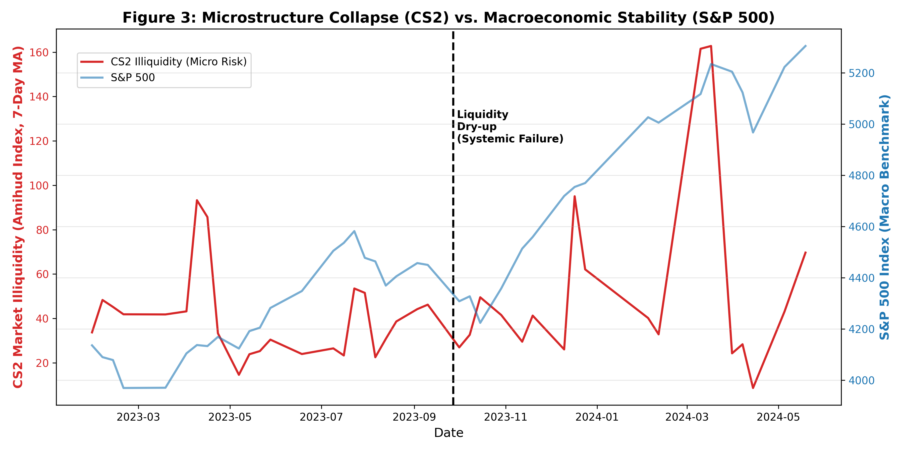
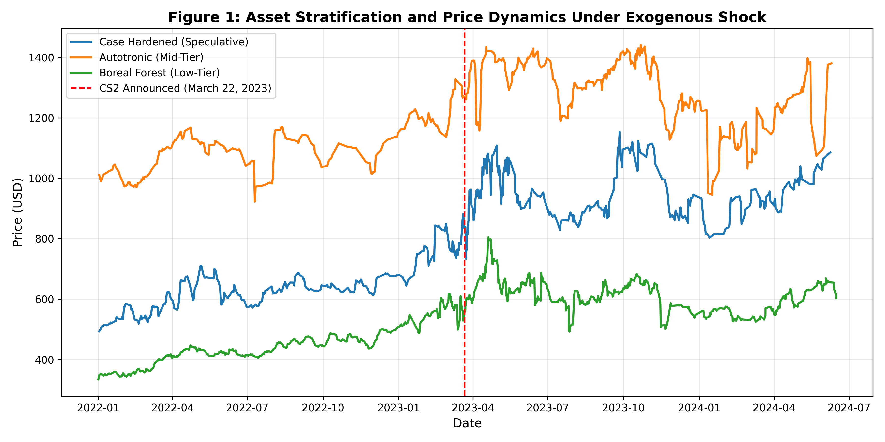
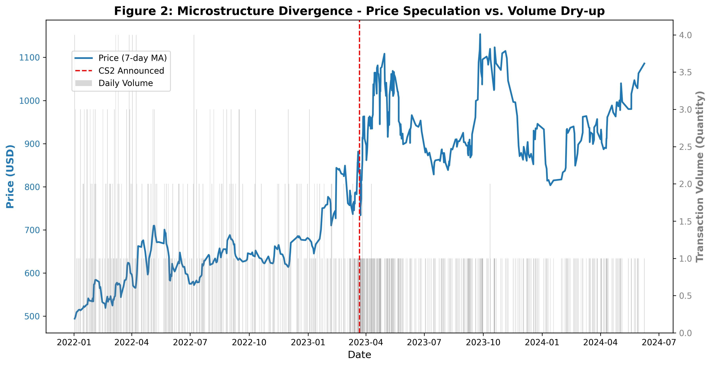

# Virtual-Economy-Microstructure
# Speculative Bubbles and Liquidity Crises in Unregulated Virtual Economies 
**An Empirical Analysis of Market Microstructure Under Exogenous Shocks**

## 📌 Executive Summary
This repository contains the data engineering pipelines, feature extraction scripts, and empirical visualizations underlying the research paper *"Speculative Bubbles and Liquidity Crises in Unregulated Virtual Economies."* Utilizing high-frequency panel data from the Counter-Strike (CS2) virtual asset market, this project investigates the financialization of digital goods and evaluates their vulnerability to liquidity risks during extreme exogenous shocks (e.g., game engine updates and shattered community expectations).

## 📊 Core Financial Insights & Empirical Evidence

Unlike traditional equity markets, this entirely unregulated virtual economy exhibited unique behavioral finance phenomena and microstructural failures during its crash. 

### 1. Liquidity Dry-up vs. Macroeconomic Stability
We constructed the **Amihud (2002) Illiquidity Measure** to quantify the price impact per unit of trading volume. The empirical result is striking: the exogenous shock triggered a sudden, severe spike in illiquidity (Red Line). Cross-referencing this with the S&P 500 Index (Blue Line) confirms that the virtual market collapsed due to a complete erosion of order book depth (an endogenous liquidity crisis), operating entirely independently of broader macroeconomic stability.

*(Figure: Divergence between CS2 Market Illiquidity and S&P 500 Macro Benchmark)*

### 2. The Retail Stampede Effect & Asset Stratification
By stratifying proxy assets (Butterfly Knives) by their speculative attributes, the data reveals a severe divergence. Low-tier essential assets (dominated by retail players) suffered massive downward volatility and severe maximum drawdowns. In contrast, highly speculative assets (consolidated by institutional-like market makers) acquired asymmetric downside resilience during the systemic crash.

*(Figure: Price Dynamics and Maximum Drawdowns Across Different Asset Tiers)*

### 3. Price Speculation vs. Volume Dry-up
During the "euphoria phase," nominal prices continuously hit new highs while underlying daily trading volume exhibited a contracting trend, indicating a rally driven by the "Greater Fool Theory." When the bubble burst, the market fell into a "quoted but untraded" trap, proving that paper wealth in unregulated networks is extremely fragile without market-maker backstops.

*(Figure: Price Action vs. Market Depth in High-Tier Speculative Assets)*

## ⚙️ Methodology & Repository Structure

The analysis relies on robust data preprocessing and feature engineering to interpret high-frequency trading data.

* **`data/`**: Contains sample time-series data for the proxy assets and the S&P 500 macroeconomic benchmark. *(Note: Full high-frequency dataset is hosted on Kaggle due to GitHub storage limits).*
* **`notebooks/`**: 
  * `01_Data_Cleaning_and_EDA.ipynb`: Data ingestion, handling missing values, and datetime indexing.
  * `02_Microstructure_Analysis.ipynb`: Feature engineering (calculating the Amihud measure, rolling MAs) and generating institutional-grade data visualizations.
* **`requirements.txt`**: Python dependencies for reproducibility (pandas, numpy, matplotlib, etc.).

## 🚀 Future Research Directions
This repository establishes the microstructural foundation of the virtual asset crash. Building upon this empirical evidence, my ongoing research at the **UIUC Econ Data Lab** will focus on:
1. **Causal Inference:** Applying a Difference-in-Differences (DiD) framework to strictly isolate the causal impact of the game engine update.
2. **Regulatory Policy:** Evaluating the potential of these platforms acting as "Shadow Banking" entities and their vulnerability to AML (Anti-Money Laundering) compliance under the Howey Test framework.
